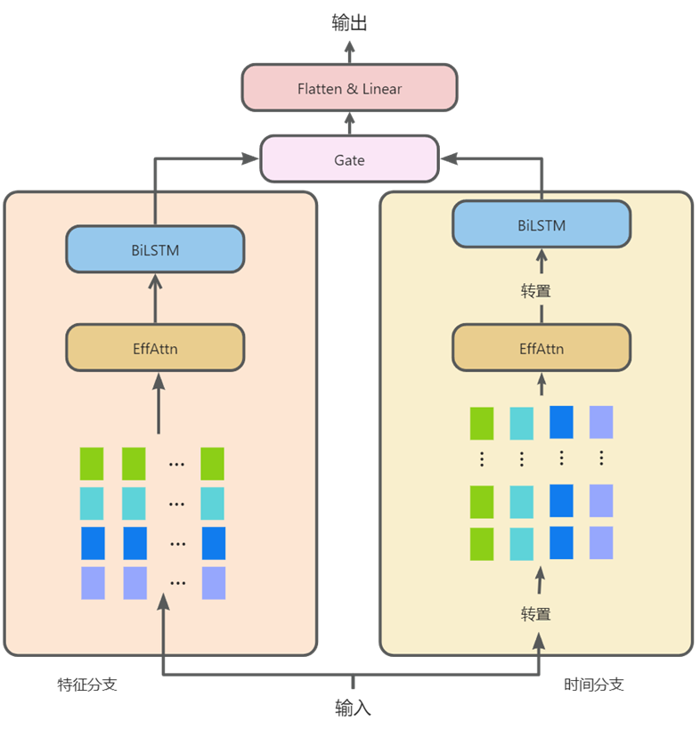
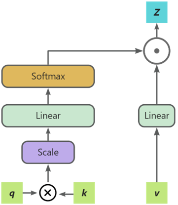

项目是利用单步预测模型DBEG进行电力负荷预测的深度学习项目，DBEG是一个针对电力负荷单步预测场景的深度学习模型。该模型引入了改进注意力机制模块EffAttn、BiLSTM和门控机制，旨在精准预测短期内电力需求变化。其中，EffAttn提高了模型的运算效率；双分支结构则全面捕捉了电力负荷数据的特征维度和时间维度的信息；BiLSTM捕捉和学习电力负荷数据中的长期依赖关系；门控机制有效整合了两个分支的输出信息。消融实验验证了模型中各个模块的有效性，而与其他预测模型的对比分析则明确展示了DBEG在短期电力负荷预测领域的优势。本研究所提出的方法为电力负荷预测领域贡献了新的视角，为电力系统的实时监控与管理提供了强有力的技术支撑。模型结构图如下：

EffAttn是针对经典注意力机制计算复杂而涉及的一种改进注意力模块，减少了经典注意力机制中的复杂矩阵乘法运算，通过一种更高效的方式计算注意力分布，减少了模型参数量和运算时间，将计算复杂度进行了降低。EffAttn的结构如下：

总结来说，DBEG采用了双分支结构，旨在同时捕捉电力负荷数据的特征维度和时间维度信息，这对于准确预测电力负荷至关重要。通过设计改进注意力模块EffAttn，增强了模型处理电力负荷数据的性能。模型引入了双向长短时记忆网络BiLSTM，有效地捕捉和学习电力负荷数据中的长期依赖关系，综合考虑整个电力负荷的上下文信息。最后将两个分支的输出整合时，设计了一种基于神经网络的门控机制Gate。它是连接特征分支和时间分支的桥梁，通过动态调节各分支输出的权重，优化了信息的整合过程。这一机制确保了模型在面对不同数据特性时的灵活性和适应性，进一步提升了预测的精度和可靠性。